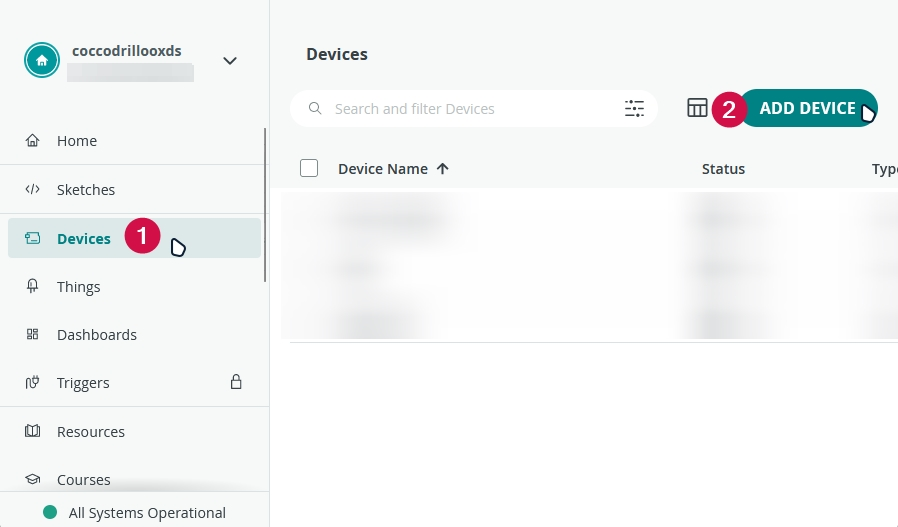
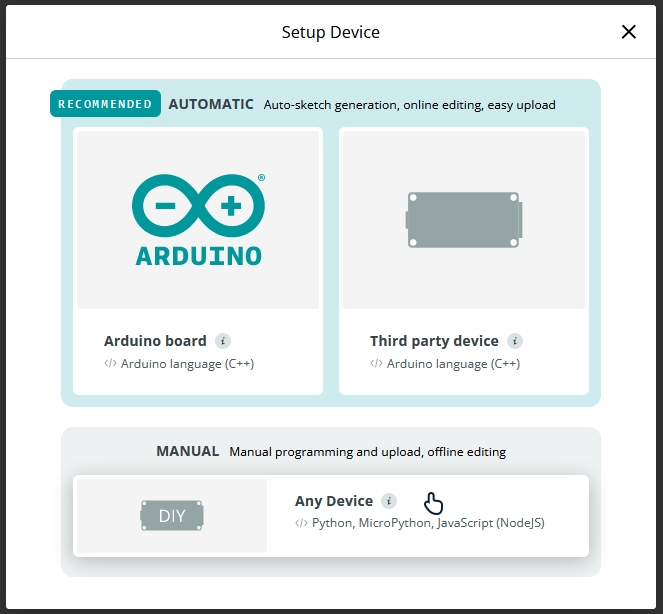
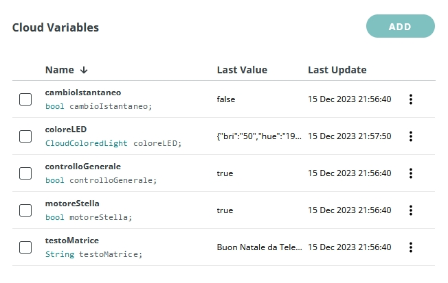
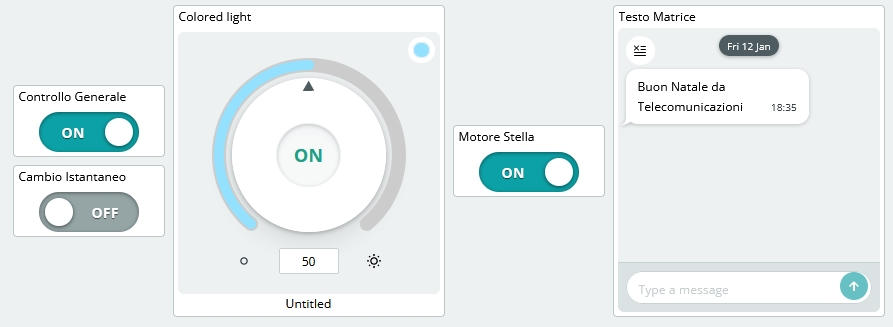
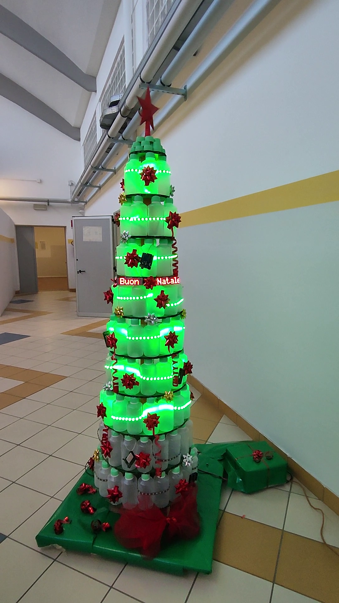

<h1 align="center">PyChristmas</h1>
<h3 align="center">Crea un albero di Natale usando Arduino IoT Cloud, Raspberry PI, strisce LED e matrici</h3>
<h4 align="center"><i>Create a Christmas Tree using Arduino IoT Cloud, Raspberry PI, LED strips and Matrix</i></h3>
<br>
<p align="center">
<a href="https://www.arduino.cc/"></a>
<a href="https://www.python.org/"></a>
<a href="https://cloud.arduino.cc/"></a>
</p>
<p align="center">
<a href="https://www.iiscastelli.edu.it/Pager.aspx?Page=mainpage"></a>

#### [Click here for the English version](README.md)

# ITALIANO:

# Panoramica
PyChristmas è un'applicazione che ti permette di costruire e controllare a distanza un albero di Natale usando Arduino IoT Cloud.

L'applicazione principale è scritta in Python e usa le API di Arduino IoT Cloud per controllare l'albero.

L'albero è composto da un Raspberry PI, un Arduino MKR WiFi 1010, 3 strisce LED, una matrice LED, un motore e una stella.

# Caratteristiche
- **Controlla l'albero a distanza** usando Arduino IoT Cloud
- **Cambia il colore dell'albero** in qualsiasi momento e ovunque
- **Scrivi un messaggio** sulla matrice LED
- **Accendi/spegni la stella** da qualsiasi luogo
- **Accendi/spegni i componenti dell'albero** tutti insieme o separatamente

# Requisiti
## Software/Servizi
- **[Account Arduino IoT Cloud](https://cloud.arduino.cc/)**
- **[Git](https://git-scm.com/)**
- **[Arduino IDE](https://www.arduino.cc/en/software)**
- **[Python](https://www.python.org/downloads/)** (versione 3.9.0 o superiore)
- **[Raspberry PI Imager](https://www.raspberrypi.org/software/)** (o qualsiasi altro software per flashare il Raspberry PI)
- **Web Browser supportato** (Chrome, Firefox, Edge, Safari, ecc.)

## Hardware
- **Breadboard**
- **Cavi jumper**
- **Computer**
- **Alimentatore** (che possa fornire almeno 5V e 3A)
- **Arduino** (Abbiamo usato un **[Arduino MKR WiFi 1010](https://store.arduino.cc/arduino-mkr-wifi-1010)**)
- **Cavo USB** per alimentare l'Arduino
- **Raspberry PI**
- **Strisce LED** (Abbiamo usato 3 strisce da 5m ciascuna con 60 LED/m)
- **Motore** (Abbiamo usato un motore da 3V)
- **Stella** (di plastica o polistirolo)
- **Matrice LED** (Abbiamo usato 2 matrici LED MAX7219 fatte con 4 moduli 8x8 ciascuna)
- **3 resistori** (Abbiamo usato resistori da 330 Ohm)
- **1 condensatore** (Abbiamo usato un condensatore da 10nF)

# Circuito


### MATRICE LED:
| Pin della scheda | Nome | Descrizione | Pin Raspberry PI | Funzione Raspberry PI |
| ---------------- | ---- | ----------- | ---------------- | --------------------- |
| 1                | VCC  | +5V         | 2                | 5V                    |
| 2                | GND  | Massa       | 6                | Massa                 |
| 3                | DIN  | Data In     | 19               | GPIO 10 (MOSI)        |
| 4                | CS   | Chip Select | 24               | GPIO 8 (SPI CE0)      |
| 5                | CLK  | Clock       | 23               | GPIO 11 (SPI CLK)     |

*tabella presa da [https://luma-led-matrix.readthedocs.io/en/latest/install.html](https://luma-led-matrix.readthedocs.io/en/latest/install.html#max7219-devices-spi)*

### STRISCE LED:
| Pin Arduino | Passa tramite | Destinazione               |
| ----------- | ------------- | -------------------------- |
| ~D3         | Resistore     | 1a striscia LED (in basso) |
| ~D4         | Resistore     | 2a striscia LED (centrale) |
| ~D5         | Resistore     | 3a striscia LED (in alto)  |
| GND         | -             | Massa sulla breadboard     |

### MOTORE E CONDENSATORE:
| Sorgente                  | Destinazione              | Destinazione Alternativa                      |
| ------------------------- | ------------------------- | --------------------------------------------- |
| Pin positivo motore       | GPIO27 (Raspberry PI)     | Alimentatore con connessioni sulla breadboard |
| pin negativo motore       | Massa sulla breadboard    | -                                             |
| pin positivo condensatore | Positivo sulla breadboard | -                                             |
| pin negativo condensatore | Massa sulla breadboard    | -                                             |


# Installazione
1. **Clona la repository**
    ```
    git clone https://github.com/CoccodrillooXDS/PyChristmas
    ```

## Arduino

2. Collega l'Arduino al computer usando il cavo USB
3. Apri l'**[Arduino IDE](https://www.arduino.cc/en/software)**
4. Seleziona la scheda Arduino che stai usando dal menu a tendina o da **Tools > Board**
    * Se stai usando un Arduino MKR WiFi 1010, potresti dover installare la scheda prima.
    * Per farlo, vai su **Tools > Board > Boards Manager** e cerca **Arduino SAMD Boards**. Clicca su **Install** e aspetta che l'installazione sia completata.
5. Seleziona la porta a cui è collegato l'Arduino dal menu a tendina o da **Tools > Port**
6. Apri il file [arduino.ino](arduino/arduino.ino) dalla cartella Arduino
7. Premi il pulsante **Upload** per verificare e caricare il codice su Arduino
8. Aspetta che il caricamento sia completato

## Raspberry PI e Python

9. Flasha il Raspberry PI con il **[Raspberry PI OS](https://www.raspberrypi.org/software/)** (questo README è stato scritto con in mente il **Raspberry PI OS**, precedentemente noto come **Raspbian**, ma puoi usare qualsiasi altro OS)
10. Collega il Raspberry PI a un monitor, una tastiera e un mouse (opzionale se vuoi usare il Raspberry PI headless via SSH)
11. Collega il Raspberry PI ad internet (puoi usare un cavo ethernet o connetterti ad una rete WiFi)
12. Apri il terminale o connettiti al Raspberry PI via SSH
13. Installa Python 3, pip e git
    ```
    sudo apt install python3 python3-pip git
    ```
14. **Clona la repository**
    ```
    git clone https://github.com/CoccodrillooXDS/PyChristmas
    ```
15. Entra nella cartella **PyChristmas**
    ```
    cd /dove/è/presente/la/cartella/PyChristmas
    ```
16. Installa i pacchetti Python richiesti
    ```
    pip3 install -r requirements.txt
    ```

## Arduino IoT Cloud
17. Apri l'**[Arduino IoT Cloud](https://cloud.arduino.cc/)**
18. Accedi con il tuo account Arduino o creane uno se non ne hai uno
19. Vai alla dashboard di Arduino IoT Cloud
20. Vai su **Devices** e clicca su **ADD DEVICE**
    
21. Seleziona "**Any Device**" sotto **MANUAL** e clicca su **CONTINUE**
    
22. Seleziona un nome per il tuo dispositivo e clicca su **NEXT**
    
23. Salva il **Device ID** e il **Device Secret** da qualche parte (ne avrai bisogno più tardi)
    
24. Seleziona la casella **I saved my device ID and Secret Key** e premi **CONTINUE**
25. Clicca su **GOT IT**
    
26. Nella nuova pagina, clicca su **Create thing**
27. In **Cloud Variables**, clicca su **ADD** e crea 5 nuove variabili **Read & Write** con **On change** Variable Update Policy:
    - **cambioIstantaneo** (bool)
    - **coloreLED** (CloudColoredLight)
    - **controlloGenerale** (bool)
    - **motoreStella** (bool)
    - **testoMatrice** (String)
    
28. Crea una nuova Dashboard cliccando su **CREATE DASHBOARD** sotto **Dashboards**
29. Aggiungi tre widget **Switch**, un widget **Colored light** e un widget **Messenger** alla dashboard
    

## Incorporare il Device ID e il Device Secret nel codice Python
30. Apri il file **[software.py](software.py)** usando un editor di testo o '*nano*' (se stai usando il terminale)
    ```
    nano software.py
    ```
31. Sostituisci le variabili **DEVICE_ID** e **DEVICE_SECRET** con quelle che hai salvato prima (Step 23). NON RIMUOVERE LA "**b**" PRIMA DELLE VIRGOLETTE
    ```python
    DEVICE_ID = b"SOSTITUISCI CON IL TUO DEVICE ID"
    SECRET_KEY = b"SOSTITUISCI CON IL TUO SECRET KEY"
    ```
32. Salva il file ed esci (se stai usando '*nano*', premi **CTRL + X**, poi **Y** e poi **INVIO**)

## Eseguire l'applicazione
33. Collega l'Arduino al Raspberry PI usando il cavo USB
34. Collega tutto come mostrato nella sezione **[circuito](#circuito)**
35. Esegui l'applicazione
    ```
    python3 software.py
    ```

**NOTA**: Puoi anche eseguire l'applicazione in background aggiungendo un **&** alla fine del comando, così:
```
python3 software.py &
```

# Risultato finale

*Purtroppo la striscia LED inferiore si è rotta durante il montaggio.*

# Contribuire
Puoi contribuire al progetto creando una pull request o un issue.

Per contribuire, puoi fare il fork della repository e dopo aver fatto le tue modifiche, puoi creare una pull request.

## Licenza
Questo progetto è sotto la **Licenza MIT**. Vedi il file **[LICENSE](LICENSE)** per maggiori informazioni.