<h1 align="center">PyChristmas</h1>
<h3 align="center">Create a Christmas Tree using Arduino IoT Cloud, Raspberry PI, LED strips and Matrix</h3>
<h4 align="center"><i>Crea un albero di Natale usando Arduino IoT Cloud, Raspberry PI, strisce LED e matrici</i></h3>
<br>
<p align="center">
<a href="https://www.arduino.cc/"></a>
<a href="https://www.python.org/"></a>
<a href="https://cloud.arduino.cc/"></a>
</p>
<p align="center">
<a href="https://www.iiscastelli.edu.it/Pager.aspx?Page=mainpage"></a>

#### [Clicca qui per la versione in italiano](README-IT.md)
# ENGLISH:

# Overview
PyChristmas is an application that allows you to build and control remotely a Christmas tree using Arduino IoT Cloud.

The main application is written in Python and uses the Arduino IoT Cloud API to control the tree.

The tree is composed by a Raspberry PI, an Arduino MKR WiFi 1010, 3 LED strips, a LED matrix, a motor and a star.

# Features
- **Control the tree remotely** using Arduino IoT Cloud 
- **Change the tree color** anytime and anywhere 
- **Write a message** on the LED matrix
- **Turn on/off the star** from anywhere
- **Turn off/on the tree components altogether or separately**

# Requirements
## Software/Services
- **[Arduino IoT Cloud account](https://cloud.arduino.cc/)**
- **[Git](https://git-scm.com/)**
- **[Arduino IDE](https://www.arduino.cc/en/software)**
- **[Python](https://www.python.org/downloads/)** (version 3.9.0 or higher)
- **[Raspberry PI Imager](https://www.raspberrypi.org/software/)** (or any other software to flash the Raspberry PI)
- **Supported web browser** (Chrome, Firefox, Edge, Safari, etc.)

## Hardware
- **Breadboard**
- **Jumper wires**
- **Computer**
- **Power Supply** (that can provide at least 5V and 3A)
- **Arduino** (We used an **[Arduino MKR WiFi 1010](https://store.arduino.cc/arduino-mkr-wifi-1010)**)
- **USB cable** to power the Arduino
- **Raspberry PI**
- **LED strips** (We used 3 strips of 5m each with 60 LEDs/m)
- **Motor** (We used a 3V motor)
- **Star** (plastic or polystyrene)
- **LED matrix** (We used 2 MAX7219 LED dot matrix display made with 4 8x8 modules each)
- **3 resistors** (We used 330 Ohm resistors)
- **1 capacitor** (We used a 10nF capacitor)

# Circuit

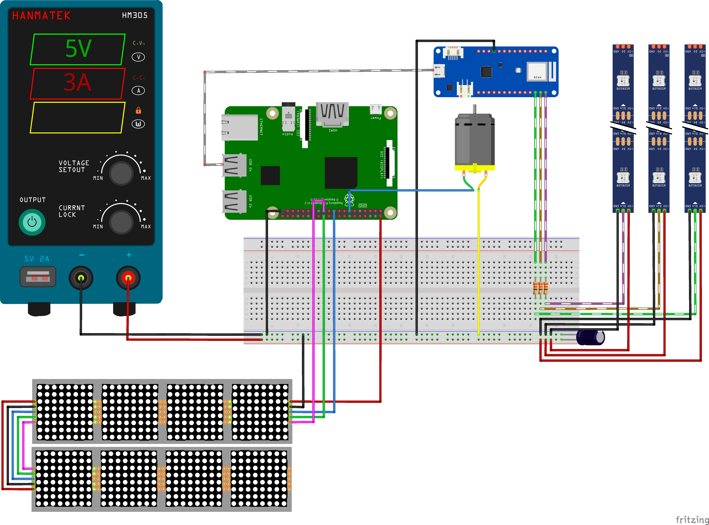

### LED MATRIX:
| Board Pin | Name | Remarks     | RPi Pin | RPi Function      |
| --------- | ---- | ----------- | ------- | ----------------- |
| 1         | VCC  | +5V Power   | 2       | 5V0               |
| 2         | GND  | Ground      | 6       | GND               |
| 3         | DIN  | Data In     | 19      | GPIO 10 (MOSI)    |
| 4         | CS   | Chip Select | 24      | GPIO 8 (SPI CE0)  |
| 5         | CLK  | Clock       | 23      | GPIO 11 (SPI CLK) |

*from [https://luma-led-matrix.readthedocs.io/en/latest/install.html](https://luma-led-matrix.readthedocs.io/en/latest/install.html#max7219-devices-spi)*

### LED STRIPS:
| Arduino Board Pin | Via      | Destination            |
| ----------------- | -------- | ---------------------- |
| ~D3               | Resistor | 1st LED strip (bottom) |
| ~D4               | Resistor | 2nd LED strip (middle) |
| ~D5               | Resistor | 3rd LED strip (top)    |
| GND               | -        | Ground on breadboard   |

### Motor and capacitor:
| Source                   | Destination            | Alternative Destination                     |
| ------------------------ | ---------------------- | ------------------------------------------- |
| Positive Pin Motor       | GPIO27 (Raspberry PI)  | Power Supply with connections on breadboard |
| Negative Pin Motor       | Ground on breadboard   | -                                           |
| Positive Pin Capacitator | Positive on breadboard | -                                           |
| Negative Pin Capacitator | Ground on breadboard   | -                                           |

# Installation

1. **Clone the repository**
    ```
    git clone https://github.com/CoccodrillooXDS/PyChristmas
    ```

## Arduino

2. Connect the Arduino to your computer using the USB cable
3. Open the **[Arduino IDE](https://www.arduino.cc/en/software)**
4. Select the Arduino board you are using from the dropdown menu or from **Tools > Board**
    * If you are using an Arduino MKR WiFi 1010, you may need to install the board first.
    * To do so, go to **Tools > Board > Boards Manager** and search for **Arduino SAMD Boards**. Click on **Install** and wait for the installation to complete.
5. Select the port your Arduino is connected to from the dropdown menu or from **Tools > Port**
6. Open the [arduino.ino](arduino/arduino.ino) file from the Arduino folder
7. Press the **Upload** button to verify and upload the code to Arduino
8. Wait for the upload to complete

## Raspberry PI and Python

9. Flash the Raspberry PI with the **[Raspberry PI OS](https://www.raspberrypi.org/software/)** (this README was written with **Raspberry PI OS**, formely known as **Raspbian**, in mind, but you can use any other OS)
10. Connect the Raspberry PI to a monitor, a keyboard and a mouse (optional if you want to use the Raspberry PI headless via SSH)
11. Connect the Raspberry PI to the internet (you can use an ethernet cable or connect to a WiFi network)
12. Open the terminal or connect to the Raspberry PI via SSH
13. Install Python 3, pip and git
    ```
    sudo apt install python3 python3-pip git
    ```
14. **Clone the repository**
    ```
    git clone https://github.com/CoccodrillooXDS/PyChristmas
    ```
15. Move to the **PyChristmas** folder
    ```
    cd /path/to/PyChristmas
    ```
16. Install the required Python packages
    ```
    pip3 install -r requirements.txt
    ```

## Arduino IoT Cloud
17. Open the **[Arduino IoT Cloud](https://cloud.arduino.cc/)**
18. Log in with your Arduino account or create one if you don't have one
19. Go to the IoT Cloud dashboard
20. Go to **Devices** and click on **ADD DEVICE**
    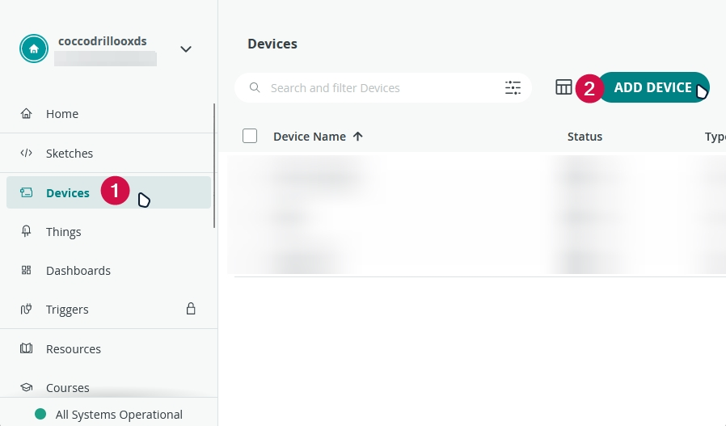
21. Select "**Any Device**" under **MANUAL** and click on **CONTINUE**
    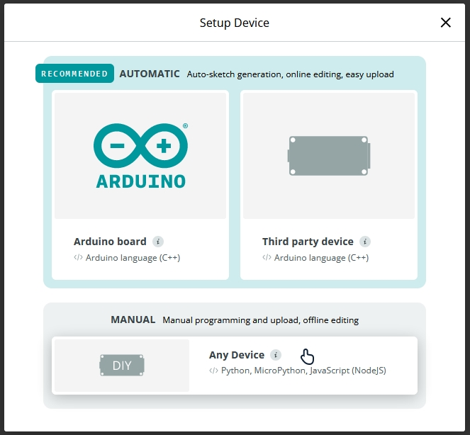
22. Select a name for your device and click on **NEXT**
    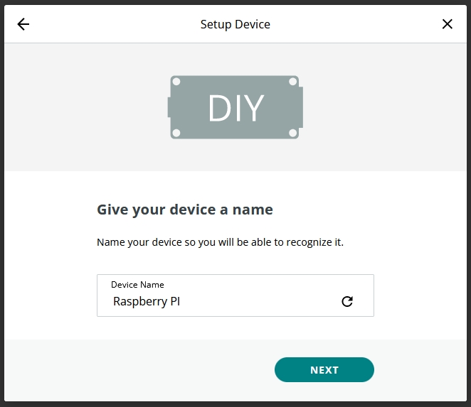
23. Save the **Device ID** and the **Device Secret** somewhere safe (we will need them later)
    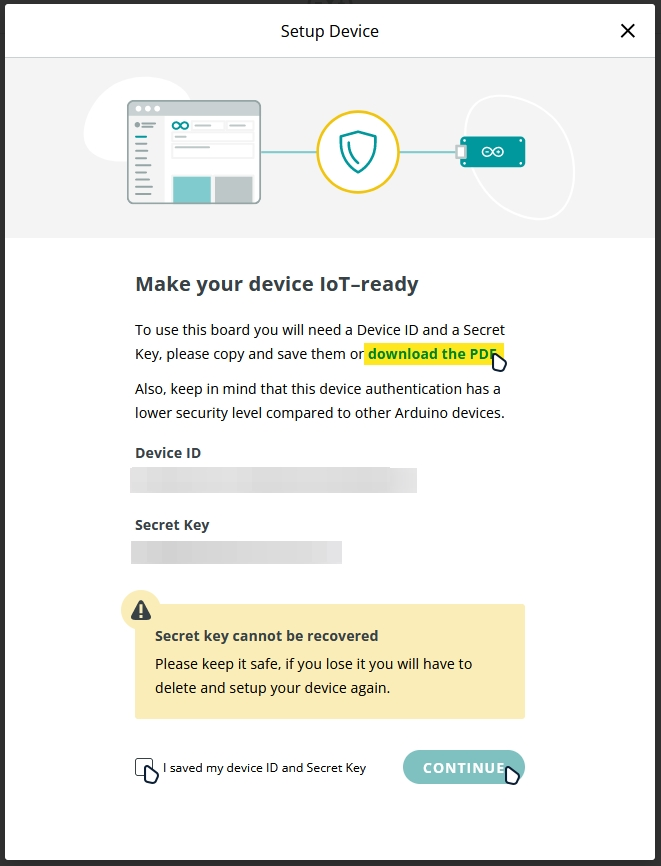
24. Check the **I saved my device ID and Secret Key** box and press **CONTINUE**
25. Click on **GOT IT**
    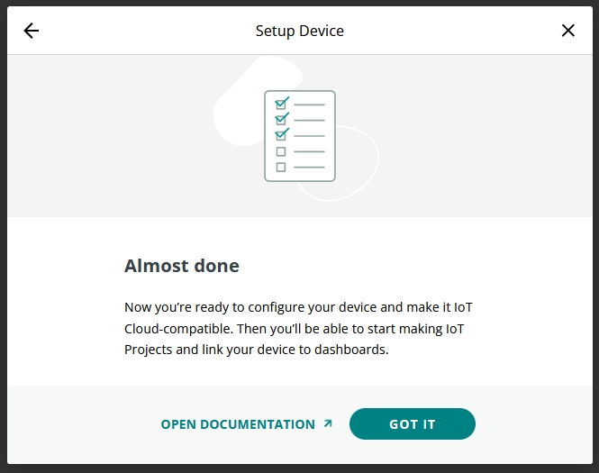
26. In the new page, click on **Create thing**
    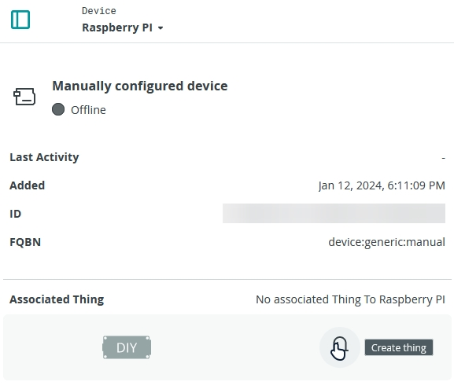
27. In **Cloud Variables**, click on **ADD** and create 5 new **Read & Write** variables with **On change** Variable Update Policy:
    - **cambioIstantaneo** (bool)
    - **coloreLED** (CloudColoredLight)
    - **controlloGenerale** (bool)
    - **motoreStella** (bool)
    - **testoMatrice** (String)
    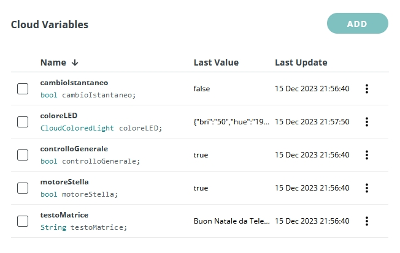
28. Create a new Dashboard by clicking on **CREATE DASHBOARD** under **Dashboards**
    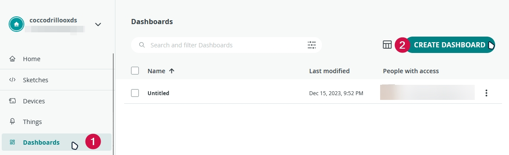
29. Add three **Switch** widgets, one **Colored light** widget and a **Messenger** widget to the dashboard
    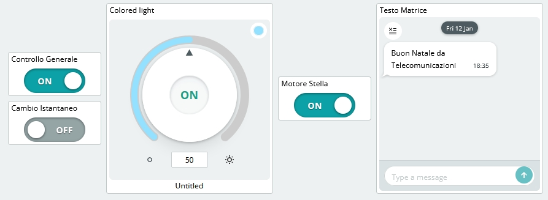

## Embedding the Device ID and Device Secret in the Python code
30. Open the **[software.py](software.py)** file using a text editor or '*nano*' (if you are using the terminal)
    ```
    nano software.py
    ```
31. Replace the **DEVICE_ID** and **DEVICE_SECRET** variables with the ones you saved earlier (Step 23). DO NOT REMOVE THE "**b**" BEFORE THE QUOTES
    ```python
    DEVICE_ID = b"REPLACE WITH YOUR DEVICE ID"
    SECRET_KEY = b"REPLACE WITH YOUR SECRET KEY"
    ```
32. Save the file and exit (if you are using '*nano*', press **CTRL + X**, then **Y** and then **ENTER**)

## Running the application
33. Connect the Arduino to the Raspberry PI using the USB cable
34. Connect everything as shown in the **[circuit](#circuit)** section
35. Run the application
    ```
    python3 software.py
    ```

**NOTE**: You can also run the application in the background by adding a **&** at the end of the command, like this:
```
python3 software.py &
```

# Final result
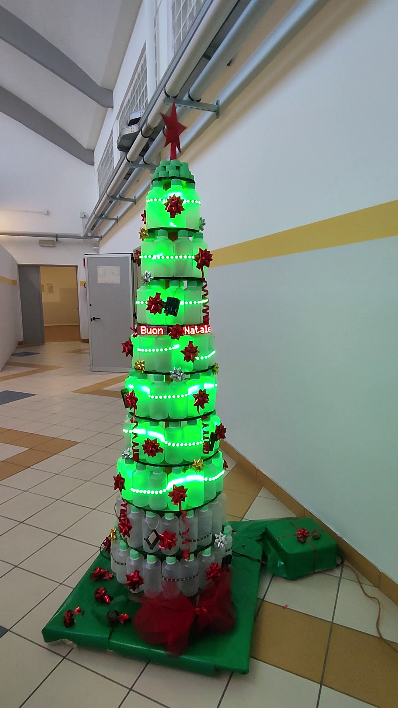
*Unfortunately, the bottom LED strip broke during the assembly.*

## Contributing
You can contribute to the project by creating a pull request or an issue.

To contribute, you can fork the repository and after you made your changes, you can create a pull request.

## License
This project is licensed under the **MIT License**. See the **[LICENSE](LICENSE)** file for more information.